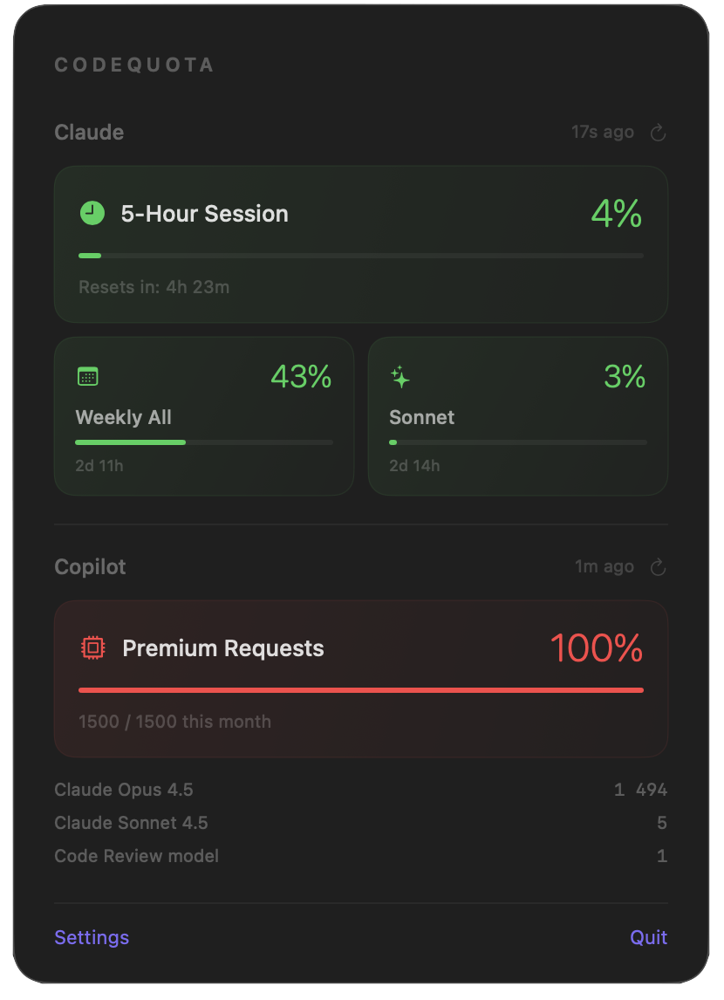
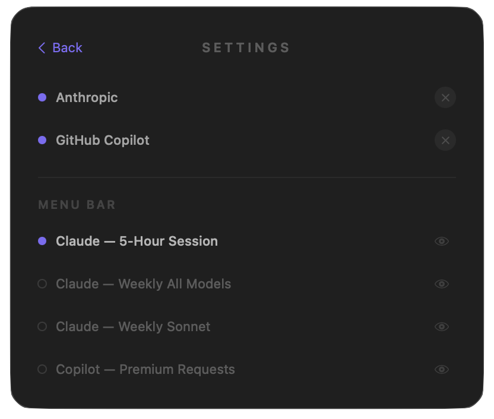

<!--
  Title: CodeQuota — Track Claude & GitHub Copilot Usage Limits | macOS Menu Bar App
  Description: Free native macOS menu bar app to monitor your Claude Pro/Max and GitHub Copilot premium request usage in real time. OAuth setup — no cookies required. Open source.
  Keywords: claude usage tracker, claude pro usage monitor, github copilot usage tracker, ai usage monitor macos, claude rate limit tracker, claude usage limits, copilot premium requests monitor, claude 5-hour session tracker, macos menu bar app ai, claude max usage, claude code usage tracker, track ai quota macos, rate limited claude
  Author: simaolucio
-->

<p align="center">
  
</p>

<p align="center">
  <a href="https://codequota.dev/"></a>
  <a href="https://github.com/simaolucio/CodeQuota/releases/latest"></a>
  
  
  <a href="https://github.com/simaolucio/CodeQuota/blob/main/LICENSE"></a>
  <a href="https://github.com/simaolucio/CodeQuota/stargazers"></a>
  <a href="https://ko-fi.com/P5P31U8CJQ"></a>
</p>

---

<p align="center">
  
  &nbsp;&nbsp;&nbsp;&nbsp;
  
</p>

---

## Why CodeQuota?

You're deep in a Claude Code session, shipping features — and suddenly: "Usage limit reached." No warning. No countdown. Your flow is broken.

Or you're burning through Copilot premium requests without realizing it, and by mid-month you're out of your allocation.

The official dashboards are buried. Checking usage means context-switching, logging into web portals, and doing mental math. There has to be a better way.

**CodeQuota puts your AI usage front and center — a glanceable fuel gauge that lives in your menu bar.**

## Feature Highlights

| Glanceable | Privacy-first | Real-time | OAuth — No cookies |
|---|---|---|---|
| Usage % + reset time right in your menu bar | All data stays on your Mac. Zero telemetry | Claude polls every 30s, Copilot every 2min | Proper auth flow, no dev tools required |

### Full Feature List

- **Menu bar usage indicator** — colored status circle + percentage + optional reset countdown, visible at a glance
- **Claude usage tracking** — monitors 5-hour rolling session, weekly all-models limit, and weekly Sonnet limit
- **Copilot usage tracking** — tracks monthly premium request usage broken down by model
- **Configurable display** — choose which metric appears in the menu bar; toggle reset time on or off
- **Color-coded progress bars** — green (<50%), yellow (50-80%), red (>80%)
- **OAuth authentication** — Anthropic PKCE + GitHub device flow. No cookies, no session keys, no browser dev tools
- **Dark, minimal UI** — borderless panel with rounded corners, consistent dark theme

**Who is this for?**

- Developers using **Claude Code**, Claude.ai, or the Claude desktop app with a Pro or Max subscription
- Anyone on a **GitHub Copilot** plan who wants to track premium request consumption per model
- Power users who rely on AI assistants daily and want to avoid surprise rate limits

## Installation

### Download

Grab the latest `.dmg` from [GitHub Releases](https://github.com/simaolucio/CodeQuota/releases), open it, and drag CodeQuota to your Applications folder.

> Since CodeQuota is ad-hoc signed (no Apple Developer account), you'll need to right-click the app and select **Open** the first time you launch it.

### Build from Source

Requires macOS 13.0 (Ventura) or later and Xcode 15.0+.

```bash
git clone https://github.com/simaolucio/CodeQuota.git
cd CodeQuota
open CodeQuota.xcodeproj
# Build and run with Cmd+R
```

## Setup

### Connect Anthropic (Claude Pro / Claude Max)

1. Launch CodeQuota — it appears in your menu bar
2. Click the menu bar icon, then **Settings**
3. Click **Connect** next to Anthropic — this opens the authorization page in your browser
4. Authorize the app, copy the code shown on the page
5. Paste the code into the app and click **Submit**

CodeQuota uses Anthropic's OAuth PKCE flow (the same one used by Claude Code) to authenticate. No cookies or session keys required.

### Connect GitHub (Copilot Premium Requests)

1. In Settings, click **Connect** next to GitHub Copilot
2. Copy the displayed device code
3. Open the GitHub device activation page and paste the code
4. Authorize the app — CodeQuota detects authorization automatically

### Choose Your Menu Bar Metric

In Settings under **Menu Bar**, select which usage metric is displayed in your status bar:

- Claude — 5-Hour Session
- Claude — Weekly All Models
- Claude — Weekly Sonnet
- Copilot — Premium Requests

### Show Reset Time

The **Show reset time** toggle (on by default) controls whether the reset countdown is displayed next to the percentage in the menu bar. Turn it off for a more compact display.

## How It Works

### Claude (Anthropic)

Once authenticated, CodeQuota polls the Anthropic usage API every 30 seconds. It tracks three metrics: your 5-hour rolling session utilization with a reset countdown, your 7-day usage across all Claude models, and your 7-day Sonnet-specific usage. These are the same limits that apply across Claude Code, Claude.ai, the desktop app, and the mobile app — they all share the same quota.

### Copilot (GitHub)

Once authenticated, CodeQuota fetches your monthly premium request billing data every 2 minutes, showing usage counts per model against your plan's included allowance. It works with any GitHub Copilot plan that includes premium requests: Copilot Pro, Pro+, Business, and Enterprise.

### Data & Security

All credentials are stored locally on your Mac in UserDefaults. Anthropic tokens are refreshed automatically. No data is sent to any third-party servers — no telemetry, no analytics, no cloud sync.

> **Note:** Credentials are currently stored in `UserDefaults`. Migration to macOS Keychain for encrypted credential storage is planned for a future release.

## FAQ

### Does CodeQuota consume any Claude tokens or Copilot requests?

No. CodeQuota only reads usage and billing data from the respective APIs. It does not make any AI model requests.

### Do I need to copy cookies or session keys?

No. Unlike most Claude usage trackers that require you to dig into browser dev tools and copy session cookies, CodeQuota uses proper OAuth authentication. Just click **Connect** and authorize in your browser — that's it.

### Does it work with Claude Code?

Yes. All Claude platforms — Claude Code, Claude.ai, the desktop app, and the mobile app — share the same underlying usage limits. CodeQuota monitors them all.

### What plans are supported?

CodeQuota works with **Claude Pro** and **Claude Max** subscriptions, and any GitHub Copilot plan that includes premium requests (Pro, Pro+, Business, Enterprise).

### Is my data sent anywhere?

No. Everything stays on your Mac. No telemetry, no analytics, no cloud sync. All credentials are stored locally.

## Project Structure

```
CodeQuota/
├── CodeQuotaApp.swift             # App entry point
├── AppDelegate.swift              # Menu bar + borderless panel setup
├── ContentView.swift              # Main panel UI (Claude + Copilot sections)
├── SettingsView.swift             # Settings UI (accounts, metrics, Ko-fi)
├── UsageIconView.swift            # Menu bar icon (configurable metric + reset time)
├── ClaudeUsageManager.swift       # Claude usage data fetching and parsing
├── AnthropicAuthManager.swift     # Anthropic OAuth PKCE authentication
├── GitHubAuthManager.swift        # GitHub device flow OAuth
├── CopilotUsageManager.swift      # Copilot premium request billing
├── MenuBarMetric.swift            # Menu bar metric selection and settings
├── Assets.xcassets/               # App icon and asset catalog
├── Info.plist                     # App configuration
└── CodeQuota.entitlements         # Sandbox permissions
.github/
└── workflows/
    └── release.yml                # Tag-based GitHub Actions release (DMG)
```

## Contributing

Contributions are welcome! Here's how to get started:

1. Fork the repo and clone it locally
2. Open `CodeQuota.xcodeproj` in Xcode 15+
3. Build and run with `Cmd+R` (requires macOS 13.0+)
4. Make your changes and submit a pull request

Check the [open issues](https://github.com/simaolucio/CodeQuota/issues) for ideas on what to work on, or open a new issue to discuss a feature or bug fix before starting.

## License

This project is licensed under the MIT License — see the [LICENSE](LICENSE) file for details.

---

<p align="center">
  <a href="https://star-history.com/#simaolucio/CodeQuota&Date">
    <picture>
      <source media="(prefers-color-scheme: dark)" srcset="https://api.star-history.com/svg?repos=simaolucio/CodeQuota&type=Date&theme=dark" />
      <source media="(prefers-color-scheme: light)" srcset="https://api.star-history.com/svg?repos=simaolucio/CodeQuota&type=Date" />
      
    </picture>
  </a>
</p>
